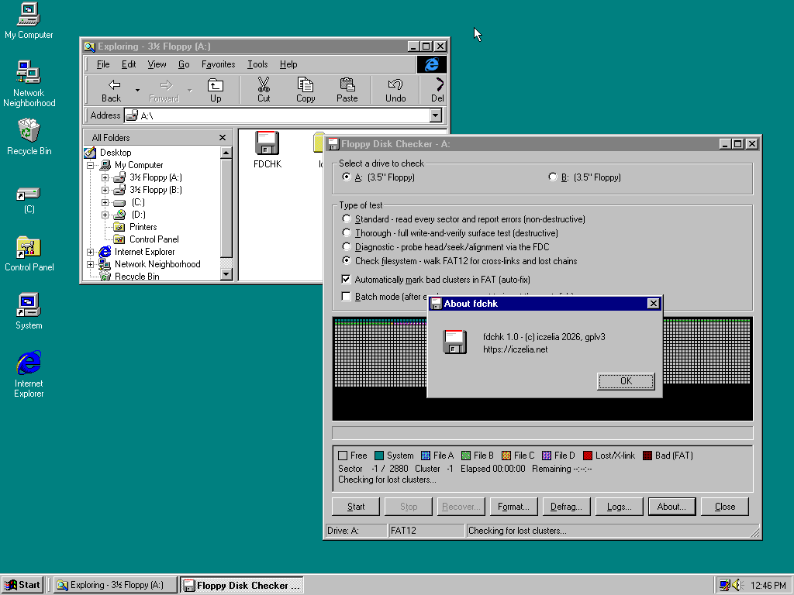

# fdchk

fdchk scans, checks, recovers, formats and defragments FAT12 floppy disks on
Windows 95, 98 and Me. It can send commands directly to the floppy controller
to test alignment and address marks.

fdchk is licensed under GNU GPL version 3. See [LICENSE](LICENSE). Report
issues to Kamila Szewczyk <k@iczelia.net>. The project is hosted at
<https://github.com/iczelia/fdchk>.



## Tests

| Test | Effect |
| --- | --- |
| Standard | Read every sector and report failures |
| Thorough | Write and check four patterns, then restore each sector |
| Diagnostic | Test seeks, alignment and sector IDs through `fdchk.vxd` |
| Check filesystem | Find FAT12 cross-links, lost chains, cycles and size errors |

The standard test reads every sector. It writes only when automatic bad-cluster
marking is enabled. In that case, fdchk marks each new bad cluster as `0xFF7`
in both FATs.

The thorough test writes four patterns to each sector and checks each pattern.
It then writes the original data back. Removing the disk or losing power before
this finishes can damage files.

The diagnostic test shows one cell for each cylinder and head. Grey means good,
yellow means being tested, orange means wrong cylinder, purple means no address
mark, and red means another read error. The VxD writes the full
`ST0/ST1/ST2/C/H/R/N` result in `fdchk-diag.log`.

The filesystem check reads the boot sector, both FATs and every directory. It
reports errors but does not write to the disk.

## Disk operations

File recovery copies every file it can read. It writes zeros where file data
cannot be read and writes details to `fdchk-recovery.log`.

Quick format writes a new boot sector, FATs and root directory. Full format
first formats and checks every track, including its sector IDs, address marks
and CRCs. It sends format commands through the DOS block driver or directly to
the FDC.

Defragmentation moves files and directories to lower cluster numbers. It works
through subdirectories and sorts each directory by name. It then writes zeros
to every free cluster. Batch mode asks for another disk after each scan. The
log viewer reads files from `<program-directory>\logs`.

## Building

The release build needs `i686-w64-mingw32-gcc` and `nasm`. `mtools` is needed
only for the floppy image.

```sh
make
make floppy
make debug
make clean
```

`make` builds `fdchk.exe` and its embedded `fdchk.vxd`. `make floppy` creates a
1.44 MB FAT12 image containing the executable. The debug build uses the C
runtime and retains symbols.
